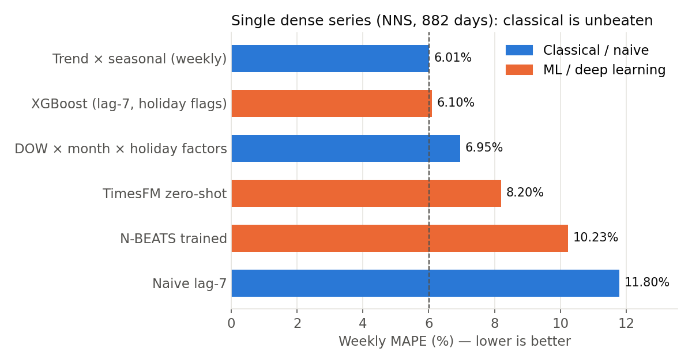
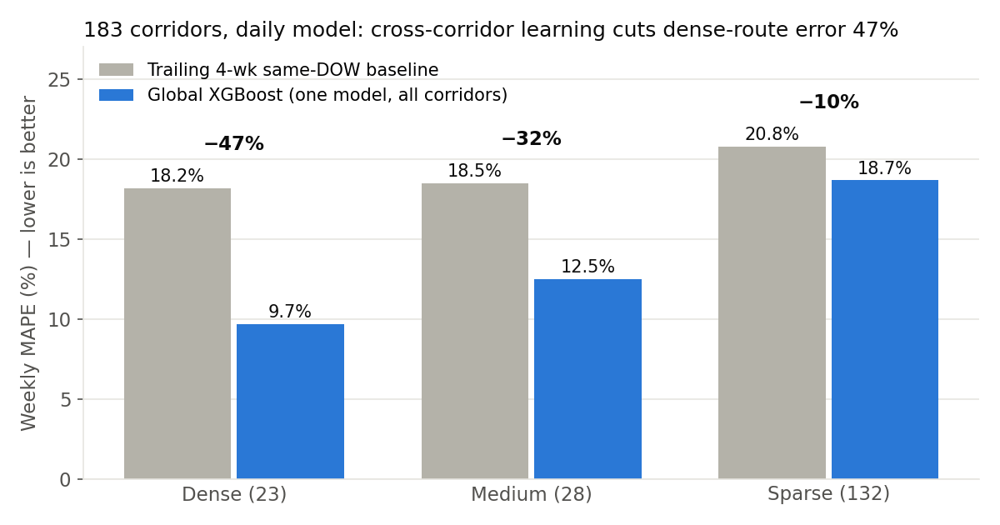

# Chicago Demand Intelligence

**ML's value depends on data density, not model sophistication.** On a single dense demand
series, a classical weekly decomposition beats every ML and deep-learning model tried. Across
183 route corridors, one global XGBoost model cuts dense-corridor error by 47%. Forecasts then
feed a deterministic decision engine that turns them into revenue-valued actions in under 0.1s.

Built on **16M Chicago taxi trips (2024–2026)**.

## Key Results

| Result | Number |
|--------|--------|
| Classical weekly baseline (single dense series, Near North Side) | **6.01% MAPE** (unbeaten by ML/DL) |
| Global XGBoost, daily, dense corridors | **47% MAPE reduction** (18.2%→9.7%; MAE 407→271) |
| Cold-start new routes (weeks 1–4) | **TimesFM zero-shot**, ~8% MAPE from day one |
| Deterministic decision pipeline | **<0.1s, $0 (no API)** — two orders of magnitude faster than full-LLM |

**On a single dense series, simple methods win.** No ML or deep-learning model beats the
classical weekly decomposition:



**Across 183 corridors, ML wins.** One global XGBoost model trained on all corridors at daily
granularity beats the baseline in every density tier, and the gain is largest where data is densest:



The full narrative is in `PROJECT_SUMMARY.md`, with per-phase write-ups in `slides/`.

## What the Demo Shows

A Streamlit app with two tabs:

- **Tab 1 — Analysis:** the forecasting benchmark (classical / ML / DL), corridor-level
  global model, total-market view, and feature validation (which signals actually predict
  demand).
- **Tab 2 — Decision Engine:** 6 data-validated action cards (DEMAND_DROP, RESOURCE_OPTIMIZE,
  DEMAND_SURGE, COMPETITIVE_SHIFT, GROWTH_THRESHOLD, ANOMALY_ESCALATION) plus a ReAct chatbot
  that reasons over the same tools.

---

## Quick Start

Python 3.13 (miniforge `base` env). Install pinned deps, then launch:

```bash
pip install -r requirements.txt
streamlit run app.py
```

Everything runs **offline** against the checked-in `data/` and `outputs/`. Only the chatbot
needs network access: set `OPENAI_API_KEY` in a `.env` file at the repo root (already
gitignored). Without it, the analysis tab and all 6 action cards still work.

## Data

`data/external/` (~51M) and `data/derived/` (~397M, includes the 356MB FAISS index) are
**not tracked in git** (size). To run from a fresh clone, either:

- copy both folders from the source machine, or
- regenerate via `scripts/0_*.py` — note `0_get_gdelt_bq.py` requires BigQuery access, and
  `6_build_faiss.py` rebuilds the FAISS index (~90s).

`data/baseline/` holds the tracked baseline CSVs (`area_week`, `backtest_8`,
`forecast_8`); its `raw/` subfolder (~6.5G) is gitignored.

## Repo Layout

- `config/` — `action_config.json`, thresholds/params for the decision engine.
- `data/` — `baseline/` (weekly baseline analysis), `external/` (weather, sports, holidays, GDELT news,
  ride-hail), `derived/` (aggregates + the FAISS index).
- `scripts/` — numbered in pipeline order (`0_*` fetch/aggregate → `8_*` model comparison;
  `9_readme_figures.py` regenerates the README figures).
  `0_get_gdelt.py` is **deprecated**, superseded by `0_get_gdelt_bq.py` (BigQuery).
- `outputs/` — benchmark CSVs and pipeline JSON results.
- `slides/` — per-phase conclusions (`phase1_3` … `phase7_8`), the narrative writeup, and the
  README figures (`fig_*.png`).
